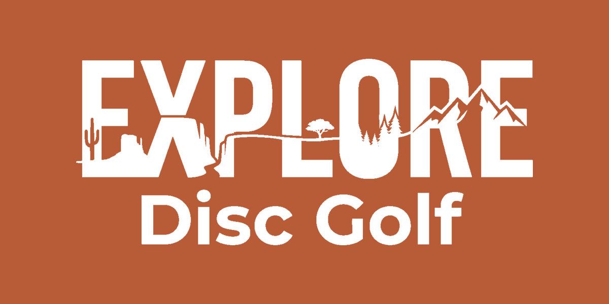
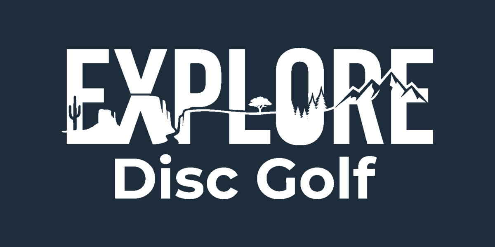

<p align="center">
  
</p>

<p align="center">
  <strong>Disc golf on America's public lands.</strong><br />
  <em>Where the wild things fly.</em>
</p>

<p align="center">
  <a href="https://opensource.org/licenses/Apache-2.0"></a>
  <a href="https://github.com/elevateut/explore-discgolf/stargazers"></a>
</p>

---

The [EXPLORE Act](https://www.congress.gov/bill/118th-congress/house-bill/6492) (P.L. 118-234) created new authorities for recreation on BLM public lands — inventories, accessibility mandates, volunteer programs, Good Neighbor Authority, and streamlined permitting. Disc golf fits those authorities unusually well: low-cost, low-impact, volunteer-built, and accessible.

But BLM manages **245 million acres** and disc golf has essentially **zero federal advocacy infrastructure**. This open source project changes that.

## What this project does

**EXPLORE Disc Golf** is three things:

1. **Learn** — Educational content that breaks down the EXPLORE Act, explains how it pertains to disc golf, and documents case studies of disc golf on federal land
2. **Find** — An interactive BLM office finder with map, boundary data, and contact info across ~220 BLM offices (12 state, 50 district, 128 field, ~30 other)
3. **Act** — Two AI-powered tools built on the Claude API:
   - A **streaming chat brainstorming tool** that researches a specific BLM office using live GIS and web data, helps you think through candidate sites, and guides the conversation toward a proposal. Conversations are saved and shareable at `/chat/[id]`.
   - A **one-shot packet generator** that produces a tailored one-pager, EXPLORE Act alignment memo, cover letter, and suggested contacts, downloadable as a PDF.

## Tech stack

| Layer | Technology | Purpose |
|-------|-----------|---------|
| Framework | [Astro 5](https://astro.build) (SSR, `output: "server"`) | Content pages, server actions, API routes |
| Hosting | [Vercel](https://vercel.com) (`@astrojs/vercel`) | Serverless SSR + static assets |
| Interactive UI | [Svelte 5](https://svelte.dev) islands | Map, office finder, streaming chat, packet viewer |
| Styling | [Tailwind v4](https://tailwindcss.com) + [DaisyUI v5](https://daisyui.com) | Brand theme: Terra Cotta, Sage, Summit Gold, Night Sky, Sandstone |
| Database | [Supabase](https://supabase.com) | Postgres, auth, RLS, cached packets, saved conversations |
| AI | [Claude API](https://docs.anthropic.com) | Streaming chat + agentic packet generation with `tool_use` and prompt caching |
| Maps | [MapLibre GL JS](https://maplibre.org) | BLM boundary and recreation site maps |
| Data | [BLM ArcGIS REST](https://gis.blm.gov/) | ~220 offices, recreation sites, admin boundaries (public, no auth) |
| PDF | [pdfkit](https://pdfkit.org) | Generates downloadable packet PDFs |

## Quick start

```bash
git clone https://github.com/elevateut/explore-discgolf.git
cd explore-discgolf
npm install
cp .env.example .env    # Add your Supabase + Anthropic keys
npm run dev              # http://localhost:4321
```

## Project structure

```
src/
  actions/         Astro Actions (typed server endpoints)
  components/      Astro + Svelte islands
                   BLMOfficeFinder, OfficeMap, OfficeCard,
                   ExploreChat, CommunityConversations, PacketViewer
  content/         Markdown collections (explore-act, resources, case-studies, news)
  data/            Seed data (BLM offices JSON)
  layouts/         BaseLayout with nav + footer
  lib/
    blm/           BLM ArcGIS client + TypeScript types
    flipt/         FLiPT client (integration deferred)
    llm/           Claude client, prompts, tools, packet generator, chat prompts
    pdf/           Packet PDF generation
    supabase/      Database client, queries, schema.sql
  pages/           File-based routes
    api/chat/        Streaming chat endpoints (message, conversation, list)
    api/packet/      Packet generation + PDF download
    chat/[id]        Shareable conversation permalinks
    offices/         Listing + dynamic [id] detail page
    explore-act/     Listing + [...slug]
    case-studies/    Listing + [...slug]
    resources/       Resources listing
  styles/          Global CSS + Tailwind directives
brand/             Logo assets, brand package PDF, build script
docs/              EXPLORE Act research, engagement templates, sources
scripts/           Seed, import, scrape, OG image generation
public/            Fonts, images, OG images, downloads
supabase/          Local Supabase config
```

Most `src/lib/*`, `src/components/`, `src/content/`, and `src/pages/` directories have an **AGENTS.md** with layer-specific documentation.

## How the AI features work

### Interactive chat (ExploreChat)

```
User opens a BLM office page → clicks "Explore Ideas"
         |
    /api/chat/message (streaming, newline-delimited JSON)
         |
    Builds system prompt with ~42K tokens of cached reference docs
    (Anthropic prompt caching, 5-minute TTL)
         |
    Claude streams a response; up to 3 tool_use rounds per message:
    - query_blm_recreation_sites   (BLM ArcGIS)
    - query_blm_office_page        (BLM.gov scrape)
    - get_engagement_history       (Supabase)
         |
    Messages persist in Supabase (conversations, conversation_messages)
    Shareable permalink at /chat/[id]
         |
    After 3+ exchanges: offer to generate a formal packet
```

Capped at 20 user messages per conversation for cost control.

### Packet generator

```
User selects a BLM field office
         |
    Astro Action / /api/packet/generate
         |
    Check Supabase generated_packets cache (7-day TTL)
         |
    On miss, gather context:
    - Office contacts              (Supabase, fallback blm-offices.json)
    - Recreation sites             (BLM ArcGIS)
    - Engagement history           (Supabase)
         |
    Claude API (claude-sonnet-4-20250514) with tool_use
    System prompt: EXPLORE Act provisions + packet templates
         |
    Structured output:
    - Tailored one-pager
    - EXPLORE Act alignment memo
    - Cover letter with specific ask
    - Suggested contacts
         |
    Cached in Supabase + PDF download via /api/packet/[officeId].pdf
```

## Contributing

We welcome contributions of all kinds:

- **Content** — Improve EXPLORE Act explainers, add case studies, update BLM office data
- **Code** — Build out the map, packet generator, office pages, or new features
- **Data** — Research BLM recreation planner contacts, identify candidate sites
- **Design** — Refine the brand, improve page layouts, create social templates
- **Advocacy** — Share your experience engaging BLM offices

See **[CONTRIBUTING.md](CONTRIBUTING.md)** for setup instructions and guidelines.

## Brand

<p align="center">
  
  
</p>

The wordmark features a diverse American landscape — cactus, buttes, savanna, forest, mountains — flowing through the letterforms, representing the breadth of BLM lands nationwide. Full brand guidelines are in **[docs/brand-guide.md](docs/brand-guide.md)** and the **[brand package PDF](brand/EXPLORE-Disc-Golf-Brand-Package.pdf)**.

## Data sources

This project uses publicly available data:

- **BLM ArcGIS REST Services** (`gis.blm.gov`) — office boundaries, recreation sites, administrative units. No authentication required.
- **Recreation.gov RIDB API** — federal recreation data. Free API key required.
- **Anthropic Claude API** — AI-generated packet content. Requires your own API key.

No private or restricted government data is used.

## License

Licensed under the [Apache License 2.0](LICENSE).

---

<p align="center">
  <strong>EXPLORE Disc Golf</strong> is a program of <a href="https://elevateut.org">ElevateUT Disc Golf</a>, a 501(c)(3) nonprofit.<br />
  <em>Find your land. Build your course.</em>
</p>
