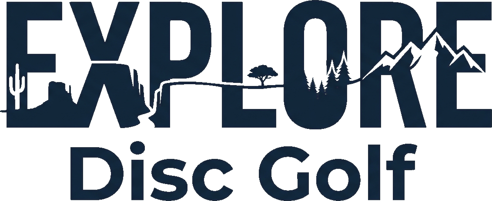

<p align="center">
  
</p>

<p align="center">
  <strong>Disc golf on America's public lands.</strong><br />
  <em>Where the wild things fly.</em>
</p>

<p align="center">
  <a href="https://opensource.org/licenses/Apache-2.0"></a>
  <a href="https://github.com/elevateut/explore-discgolf/stargazers"></a>
</p>

---

The [EXPLORE Act](https://www.congress.gov/bill/118th-congress/house-bill/6492) (P.L. 118-234) created new authorities for recreation on BLM public lands — inventories, accessibility mandates, volunteer programs, Good Neighbor Authority, and streamlined permitting. Disc golf fits those authorities unusually well: low-cost, low-impact, volunteer-built, and accessible.

But BLM manages **245 million acres** and disc golf has essentially **zero federal advocacy infrastructure**. This open source project changes that.

## What this project does

**EXPLORE Disc Golf** is three things:

1. **Learn** — Educational content that breaks down the EXPLORE Act, explains how it pertains to disc golf, and documents case studies of disc golf on federal land
2. **Find** — An interactive BLM office finder with map, boundary data, contact info, and engagement status tracking across 128 field offices
3. **Act** — An AI-powered packet generator that creates customized BLM engagement materials for any field office, using live GIS data and the Claude API

## Tech stack

| Layer | Technology | Purpose |
|-------|-----------|---------|
| Framework | [Astro 5](https://astro.build) (SSR) | Content pages + server actions |
| Interactive UI | [Svelte 5](https://svelte.dev) | Client-side islands (map, search, office cards) |
| Styling | [Tailwind v4](https://tailwindcss.com) + [DaisyUI v5](https://daisyui.com) | Brand theme: Terra Cotta, Sage, Summit Gold, Night Sky, Sandstone |
| Database | [Supabase](https://supabase.com) | Postgres, auth, RLS, cached packets |
| AI | [Claude API](https://docs.anthropic.com) | LLM-powered engagement packet generation with tool use |
| Maps | [MapLibre GL JS](https://maplibre.org) | BLM boundary and recreation site maps |
| Data | [BLM ArcGIS REST](https://gis.blm.gov/) | 220 offices, 1,048 rec sites, field office boundaries (public, no auth) |

## Quick start

```bash
git clone https://github.com/elevateut/explore-discgolf.git
cd explore-discgolf
npm install
cp .env.example .env    # Add your Supabase + Anthropic keys
npm run dev              # http://localhost:4321
```

## Project structure

```
src/
  actions/         Server-side Astro Actions (packet generation)
  components/      Svelte islands (BLMOfficeFinder, OfficeCard)
  content/         Markdown collections (explore-act, resources, case-studies, news)
  data/            Seed data (BLM offices JSON)
  layouts/         BaseLayout with nav + footer
  lib/
    blm/           BLM ArcGIS client + TypeScript types
    llm/           Claude API client, prompts, tools, packet generator
    pdf/           PDF generation from LLM output
    supabase/      Database client, queries, schema
  pages/           Routes (/, /explore-act, /offices/[id], /resources, etc.)
  styles/          Global CSS + Tailwind directives
brand/             Logo assets, brand package PDF, build script
docs/              EXPLORE Act research, engagement templates, sources
public/            Fonts, images, downloads
```

Every `lib/` subdirectory and key folder has an **AGENTS.md** with detailed documentation for that layer.

## How the BLM packet generator works

```
User selects a BLM field office
         |
    Astro Action (server-side)
         |
    Gathers context:
    - Office contacts (Supabase)
    - Recreation sites (BLM ArcGIS)
    - Nearby disc golf courses
    - Engagement history
         |
    Claude API (with tool_use)
    - System prompt: EXPLORE Act provisions + packet templates
    - User context: all office-specific data
         |
    Structured output:
    - Tailored one-pager
    - EXPLORE Act alignment memo
    - Cover letter with specific ask
    - Suggested contacts
         |
    Cached in Supabase + PDF download
```

## Contributing

We welcome contributions of all kinds:

- **Content** — Improve EXPLORE Act explainers, add case studies, update BLM office data
- **Code** — Build out the map, packet generator, office pages, or new features
- **Data** — Research BLM recreation planner contacts, identify candidate sites
- **Design** — Refine the brand, improve page layouts, create social templates
- **Advocacy** — Share your experience engaging BLM offices

See **[CONTRIBUTING.md](CONTRIBUTING.md)** for setup instructions and guidelines.

## Brand

<p align="center">
  
  
</p>

The wordmark features a diverse American landscape — cactus, buttes, savanna, forest, mountains — flowing through the letterforms, representing the breadth of BLM lands nationwide. Full brand guidelines are in **[docs/brand-guide.md](docs/brand-guide.md)** and the **[brand package PDF](brand/EXPLORE-Disc-Golf-Brand-Package.pdf)**.

## Data sources

This project uses publicly available data:

- **BLM ArcGIS REST Services** (`gis.blm.gov`) — office boundaries, recreation sites, administrative units. No authentication required.
- **Recreation.gov RIDB API** — federal recreation data. Free API key required.
- **Anthropic Claude API** — AI-generated packet content. Requires your own API key.

No private or restricted government data is used.

## License

Licensed under the [Apache License 2.0](LICENSE).

---

<p align="center">
  <strong>EXPLORE Disc Golf</strong> is a program of <a href="https://elevateut.org">ElevateUT Disc Golf</a>, a 501(c)(3) nonprofit.<br />
  <em>Find your land. Build your course.</em>
</p>
